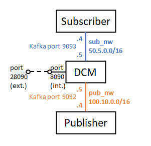

# 1. Complete DCM with subscriber and publisher

This README file contains all the steps to be followed to deploy this scenario, in which a complete Docker container containing all the DCM logic is deployed in combination with a subscriber and a publisher.

The DCM container has two interfaces, one for connecting to the subscriber and other for connecting to the publisher.



## Docker images involved

The following Docker images have been used for this deployment. Please verify that these images have been built beforehand.

* **Complete DCM:** available in this repository: [dcm](../../docker_images/full_components/dcm).
* **Python subscriber:** available in this repository: [py_subscriber](../../docker_images/separated_components/py_subscriber).
* **Python publisher:** available in this repository: [py_publisher](../../docker_images/separated_components/py_publisher).

## Steps to be followed

### 1. Create networks

There are two alternatives to do this:

* In case you want to be connected to the host (default), execute the following commands:

```sh
$ docker network create --driver bridge --subnet=100.10.0.0/16 pub_nw
$ docker network create --driver bridge --subnet=50.5.0.0/16 sub_nw
```

* Otherwise, in case you do not want to be connected to the host, execute the following commands:

```sh
$ PUB_NW_ID=$(docker network create --driver bridge --subnet=100.10.0.0/16 pub_nw | sed -e "s/^\(.\{12\}\).*/\1/")
$ ip a d $(ip -4 addr show br-"$PUB_NW_ID" | grep -oP "(?<=inet\s)\d+(\.\d+){3}/\\d+") dev br-"$PUB_NW_ID"
$ SUB_NW_ID=$(docker network create --driver bridge --subnet=50.5.0.0/16 sub_nw | sed -e "s/^\(.\{12\}\).*/\1/")
$ ip a d $(ip -4 addr show br-"$SUB_NW_ID" | grep -oP "(?<=inet\s)\d+(\.\d+){3}/\\d+") dev br-"$SUB_NW_ID"
```

### 2. Run the DCM

Run the DCM with the following environment configuration in the env_file file:

```sh
listener_ip_addresses=PUB://0.0.0.0:9092,SUB://0.0.0.0:9093
adv_listener_ip_addresses=PUB://100.10.0.5:9092,SUB://50.5.0.5:9093
broker_id=0
zookeeper_ip_address=127.0.0.1
listener_security_protocol_map=PUB:PLAINTEXT,SUB:PLAINTEXT
inter_broker_listener_name=PUB
rack_name=dcm
network_commands="false"
```

The command to run the DCM is the following:

```sh
$ docker run --name dcm_container -p 28090:8090 --env-file=env_file --net pub_nw --ip 100.10.0.5 -d dcm; docker network connect --ip 50.5.0.5 sub_nw dcm_container
```

In the meanwhile, you can check all the configuration of the DCM by opening a bash session.

```sh
$ docker exec -it dcm_container /bin/bash
```

Remember to wait until obtaining a correct response from the DCM Python logic before continuing with the test.

```sh
$ curl --location --request GET 'http://127.0.0.1:28090'
```

### 3. Create the Kafka topic (topictest) in the DCM

```sh
$ docker exec -it dcm_container /opt/kafka/bin/kafka-topics.sh --create --replication-factor 1 --zookeeper 127.0.0.1:2181 --topic topictest --partitions 1
```

You can check the correct execution of the previous command with the following command (it should output "topictest")

```sh
$ docker exec -it dcm_container /opt/kafka/bin/kafka-topics.sh --list --zookeeper 127.0.0.1:2181
```

### 4. Run the subscriber

After running the subscriber container, it will wait for the messages sent to the topictest topic, so this container will never end its execution unless you stop it.

```sh
$ docker run --name sub_container --net sub_nw --ip 50.5.0.4 -it py_subscriber python3 subscriber.py 50.5.0.5:9093 topictest
```

If you want to create a Kafka native subscriber too, you can execute the following command:

```sh
$ docker exec -it dcm_container /opt/kafka/bin/kafka-console-consumer.sh --bootstrap-server 127.0.0.1:9092 --topic topictest --from-beginning
```

### 5. Run the publisher

The publisher will publish 10 metrics in the topictest topic, and then it will finish its execution, then the container will be stopped automatically.

```sh
$ docker run --name pub_container --net pub_nw --ip 100.10.0.4 -it py_publisher python3 publisher.py 100.10.0.5:9092 topictest 10
```

In the meanwhile, check that the subscriber receives the messages sent by the publisher.

### 6. Cleaning the scenario

To clean the scenario, you can execute the following commands:

```sh
$ docker container stop $(docker container ls -a -q)
$ docker container rm $(docker container ls -a -q)
$ docker network rm pub_nw sub_nw
```
