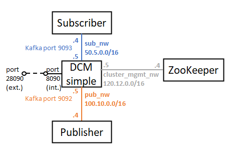

# 2. Uncoupled DCM with subscriber and publisher

This README file contains all the steps to be followed to deploy this scenario, in which the DCM is uncoupled in different containers, each of them representing a specific building block. This uncoupled DCM is deployed in combination with a subscriber and a publisher.



## Docker images involved

The following Docker images have been used for this deployment. Please verify that these images have been built beforehand.

* **DCM simple:** available in this repository: [dcm_simple](../../docker_images/separated_components/dcm_simple).
* **ZooKeeper:** available in this repository: [zookeeper](../../docker_images/separated_components/zookeeper).
* **Python subscriber:** available in this repository: [py_subscriber](../../docker_images/separated_components/py_subscriber).
* **Python publisher:** available in this repository: [py_publisher](../../docker_images/separated_components/py_publisher).

## Steps to be followed

### 1. Create networks

There are two alternatives to do this:

* In case you want to be connected to the host (default), execute the following commands:

```sh
$ docker network create --driver bridge --subnet=100.10.0.0/16 pub_nw
$ docker network create --driver bridge --subnet=50.5.0.0/16 sub_nw
$ docker network create --driver bridge --subnet=120.12.0.0/16 cluster_mgmt_nw
```

* Otherwise, in case you do not want to be connected to the host, execute the following commands:

```sh
$ PUB_NW_ID=$(docker network create --driver bridge --subnet=100.10.0.0/16 pub_nw | sed -e "s/^\(.\{12\}\).*/\1/")
$ ip a d $(ip -4 addr show br-"$PUB_NW_ID" | grep -oP "(?<=inet\s)\d+(\.\d+){3}/\\d+") dev br-"$PUB_NW_ID"
$ SUB_NW_ID=$(docker network create --driver bridge --subnet=50.5.0.0/16 sub_nw | sed -e "s/^\(.\{12\}\).*/\1/")
$ ip a d $(ip -4 addr show br-"$SUB_NW_ID" | grep -oP "(?<=inet\s)\d+(\.\d+){3}/\\d+") dev br-"$SUB_NW_ID"
$ CLUSTER_MGMT_NW_ID=$(docker network create --driver bridge --subnet=120.12.0.0/16 cluster_mgmt_nw | sed -e "s/^\(.\{12\}\).*/\1/")
$ ip a d $(ip -4 addr show br-"$CLUSTER_MGMT_NW_ID" | grep -oP "(?<=inet\s)\d+(\.\d+){3}/\\d+") dev br-"$CLUSTER_MGMT_NW_ID"
```

### 2. Run ZooKeeper

```sh
$ docker run --name zookeeper_container --net cluster_mgmt_nw --ip 120.12.0.4 -d zookeeper
```

### 3. Run DCM simple

Run the simplified version of the DCM with the following environment configuration in the env_file file:

```sh
dcm_ip_address=127.0.0.1
zookeeper_ip_address=120.12.0.4
kafka_port=9092
listener_ip_addresses=PUB://0.0.0.0:9092,SUB://0.0.0.0:9093
adv_listener_ip_addresses=PUB://100.10.0.5:9092,SUB://50.5.0.5:9093
broker_id=1
listener_security_protocol_map=PUB:PLAINTEXT,SUB:PLAINTEXT
inter_broker_listener_name=PUB
rack_name=dcm
network_commands="false"
```

The command to run DCM simple is the following:

```sh
$ docker run --name dcm_simple_container -p 28090:8090 --env-file=env_file --net cluster_mgmt_nw --ip 120.12.0.5 -d dcm_simple; docker network connect --ip 100.10.0.5 pub_nw dcm_simple_container; docker network connect --ip 50.5.0.5 sub_nw dcm_simple_container
```

In the meanwhile, you can check all the configuration of the container by opening a bash session.

```sh
$ docker exec -it dcm_simple_container /bin/bash
```

Remember to wait until obtaining a correct response from the DCM handler before continuing with the test.

```sh
$ curl --location --request GET 'http://127.0.0.1:28090'
```

### 4. Create the Kafka topic (topictest) in the DCM

```sh
$ docker exec -it dcm_simple_container /opt/kafka/bin/kafka-topics.sh --create --replication-factor 1 --zookeeper 120.12.0.4:2181 --topic topictest --partitions 1
```

You can check the correct execution of the previous command with the following command (it should output "topictest")

```sh
$ docker exec -it dcm_simple_container /opt/kafka/bin/kafka-topics.sh --list --zookeeper 120.12.0.4:2181
```

### 5. Run the subscriber

After running the subscriber container, it will wait for the messages sent to the topictest topic, so this container will never end its execution unless you stop it.

```sh
$ docker run --name sub_container --net sub_nw --ip 50.5.0.4 -it py_subscriber python3 subscriber.py 50.5.0.5:9093 topictest
```

If you want to create a Kafka native subscriber too, you can execute the following command:

```sh
$ docker exec -it dcm_simple_container /opt/kafka/bin/kafka-console-consumer.sh --bootstrap-server 127.0.0.1:9092 --topic topictest --from-beginning
```

### 6. Run the publisher

The publisher will publish 10 metrics in the topictest topic, and then it will finish its execution, then the container will be stopped automatically.

```sh
$ docker run --name pub_container --net pub_nw --ip 100.10.0.4 -it py_publisher python3 publisher.py 100.10.0.5:9092 topictest 10
```

In the meanwhile, check that the subscriber receives the messages sent by the publisher.

### 7. Create a new topic with the DCM handler

First of all, create a signalling topic, e.g. signalling.kpi:

```sh
$ docker exec -it dcm_simple_container /opt/kafka/bin/kafka-topics.sh --create --replication-factor 1 --zookeeper 120.12.0.4:2181 --topic signalling.kpi --partitions 1
```

Then, send a new KPI topic to be created in the platform by the DCM

```sh
$ curl --location --request POST 'http://127.0.0.1:28090/dcm/publish/signalling.kpi' \
--header 'Content-Type: application/json' \
--data-raw '{
	"records": [
		{
			"value": {
				"topic": "uc.4.france_nice.kpi.service_delay",
				"expId": "4",
				"action": "subscribe",
				"context": {
					"kpiId": "service_delay",
					"graph": "LINE",
					"name": "kpi_name",
					"unit": "kpi_unit",
					"interval": "5s"
				}
			}
		}
	]
}'
```

If you list the topics currently created, you will see that topictest, signalling.kpi and uc.4.france_nice.kpi.service_delay have been created.

```sh
$ docker exec -it dcm_simple_container /opt/kafka/bin/kafka-topics.sh --list --zookeeper 120.12.0.4:2181
```

### 8. Run the subscriber with the new topic created by the DCM handler

After running the subscriber container, it will wait for the messages sent to the uc.4.france_nice.kpi.service_delay topic, so this container will never end its execution unless you stop it.

```sh
$ docker run --name sub_container_2 --net sub_nw --ip 50.5.0.4 -it py_subscriber python3 subscriber.py 50.5.0.5:9093 uc.4.france_nice.kpi.service_delay
```

If you want to create a Kafka native subscriber too, you can execute the following command:

```sh
$ docker exec -it dcm_simple_container /opt/kafka/bin/kafka-console-consumer.sh --bootstrap-server 127.0.0.1:9092 --topic uc.4.france_nice.kpi.service_delay --from-beginning
```

### 9. Run the publisher with the new topic created by the DCM handler

The publisher will publish 10 metrics in the uc.4.france_nice.kpi.service_delay topic, and then it will finish its execution, then the container will be stopped automatically.

```sh
$ docker run --name pub_container_2 --net pub_nw --ip 100.10.0.4 -it py_publisher python3 publisher.py 100.10.0.5:9092 uc.4.france_nice.kpi.service_delay 10
```

In the meanwhile, check that the subscriber receives the messages sent by the publisher.

### 10. Delete the topic created by the DCM handler and check the messages in the signalling topic

Remove the topic created previously by the DCM handler by sending this request:

```sh
$ curl --location --request POST 'http://127.0.0.1:28090/dcm/publish/signalling.kpi' \
--header 'Content-Type: application/json' \
--data-raw '{
	"records": [
		{
			"value": {
				"topic": "uc.4.france_nice.kpi.service_delay",
				"expId": "4",
				"action": "unsubscribe",
				"context": {
					"kpiId": "service_delay",
					"graph": "LINE",
					"name": "kpi_name",
					"unit": "kpi_unit",
					"interval": "5s"
				}
			}
		}
	]
}'
```

If you list the topics currently created, you will see that topictest and signalling.kpi are the topics present in the broker, and that uc.4.france_nice.kpi.service_delay has been deleted.

```sh
$ docker exec -it dcm_simple_container /opt/kafka/bin/kafka-topics.sh --list --zookeeper 120.12.0.4:2181
```

Finally, if you create a subscriber listening to the messages sent to the signalling.kpi topic, you will be able to see the two messages sent in the previous requests generated with curl: one for the subscribe operation and other for the unsubscribe operation:

```sh
# With Python:
$ docker run --name sub_container_3 --net sub_nw --ip 50.5.0.4 -it py_subscriber python3 subscriber.py 50.5.0.5:9093 signalling.kpi

# With Kafka commands:
$ docker exec -it dcm_simple_container /opt/kafka/bin/kafka-console-consumer.sh --bootstrap-server 127.0.0.1:9092 --topic signalling.kpi --from-beginning
```

### 11. Cleaning the scenario

To clean the scenario, you can execute the following commands:

```sh
$ docker container stop $(docker container ls -a -q)
$ docker container rm $(docker container ls -a -q)
$ docker network rm pub_nw sub_nw cluster_mgmt_nw
```
