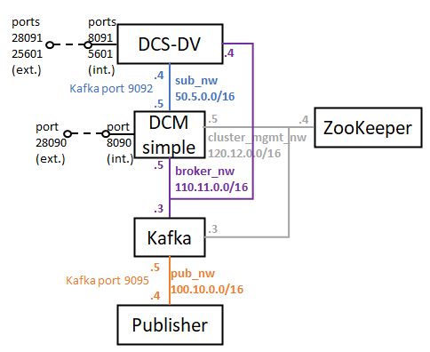

# 3. Two Kafka brokers with DCS-DV and publisher

This README file contains all the steps to be followed to deploy this scenario, in which a multi-broker architecture is presented, with one Kafka broker related to one specific site and another Kafka broker related to the Interworking Layer. A Kafka publisher based on Python produces the messages to be sent to the Kafka cluster, being received by a complete DCS-DV instance. Note that the DCS-DV needs to be connected logically to all the brokers of the cluster in order to make the solution work.



## Docker images involved

The following Docker images have been used for this deployment. Please verify that these images have been built beforehand.

* **DCM simple:** available in this repository: [dcm_simple](../../docker_images/separated_components/dcm_simple/v1)
* **Kafka:** available in this repository: [kafka](../../docker_images/separated_components/kafka/v1).
* **ZooKeeper:** available in this repository: [zookeeper](../../docker_images/separated_components/zookeeper).
* **Complete DCS-DV:** available in this repository: [dcs_dv](../../docker_images/full_components/dcs_dv).
* **Complex Python publisher:** available in this repository: [complex_publisher](../../docker_images/separated_components/complex_publisher).

## Steps to be followed

### 1. Create networks

There are two alternatives to do this:

* In case you want to be connected to the host (default), execute the following commands:

```sh
$ docker network create --driver bridge --subnet=100.10.0.0/16 pub_nw
$ docker network create --driver bridge --subnet=50.5.0.0/16 sub_nw
$ docker network create --driver bridge --subnet=120.12.0.0/16 cluster_mgmt_nw
$ docker network create --driver bridge --subnet=110.11.0.0/16 broker_nw
```

* Otherwise, in case you do not want to be connected to the host, execute the following commands:

```sh
$ PUB_NW_ID=$(docker network create --driver bridge --subnet=100.10.0.0/16 pub_nw | sed -e "s/^\(.\{12\}\).*/\1/")
$ ip a d $(ip -4 addr show br-"$PUB_NW_ID" | grep -oP "(?<=inet\s)\d+(\.\d+){3}/\\d+") dev br-"$PUB_NW_ID"
$ SUB_NW_ID=$(docker network create --driver bridge --subnet=50.5.0.0/16 sub_nw | sed -e "s/^\(.\{12\}\).*/\1/")
$ ip a d $(ip -4 addr show br-"$SUB_NW_ID" | grep -oP "(?<=inet\s)\d+(\.\d+){3}/\\d+") dev br-"$SUB_NW_ID"
$ CLUSTER_MGMT_NW_ID=$(docker network create --driver bridge --subnet=120.12.0.0/16 cluster_mgmt_nw | sed -e "s/^\(.\{12\}\).*/\1/")
$ ip a d $(ip -4 addr show br-"$CLUSTER_MGMT_NW_ID" | grep -oP "(?<=inet\s)\d+(\.\d+){3}/\\d+") dev br-"$CLUSTER_MGMT_NW_ID"
$ BROKER_NW_ID=$(docker network create --driver bridge --subnet=110.11.0.0/16 broker_nw | sed -e "s/^\(.\{12\}\).*/\1/")
$ ip a d $(ip -4 addr show br-"$BROKER_NW_ID" | grep -oP "(?<=inet\s)\d+(\.\d+){3}/\\d+") dev br-"$BROKER_NW_ID"
```

### 2. Run ZooKeeper

```sh
$ docker run --name zookeeper_container --net cluster_mgmt_nw --ip 120.12.0.4 -d zookeeper
```

### 3. Run DCM simple

Run the simplified version of the DCM with the following environment configuration in the env_file file:

```sh
dcm_ip_address=127.0.0.1
zookeeper_ip_address=120.12.0.4
kafka_port=9092
listener_ip_addresses=PLAINTEXT://0.0.0.0:9092
adv_listener_ip_addresses=PLAINTEXT://dcm:9092
broker_id=1
listener_security_protocol_map=PLAINTEXT:PLAINTEXT
inter_broker_listener_name=PLAINTEXT
rack_name=dcm
network_commands=echo '127.0.0.1 dcm' | tee -a /etc/hosts > /dev/null; echo '110.11.0.3 france' | tee -a /etc/hosts > /dev/null
```

The command to run DCM simple is the following:

```sh
$ docker run --name dcm_simple_container -p 28090:8090 --env-file=env_file --net cluster_mgmt_nw --ip 120.12.0.5 -d dcm_simple; docker network connect --ip 110.11.0.5 broker_nw dcm_simple_container; docker network connect --ip 50.5.0.5 sub_nw dcm_simple_container
```

In the meanwhile, you can check all the configuration of the container by opening a bash session.

```sh
$ docker exec -it dcm_simple_container /bin/bash
```

Remember to wait until obtaining a correct response from the DCM handler before continuing with the test.

```sh
$ curl --location --request GET 'http://127.0.0.1:28090'
```

### 3. Run the other Kafka broker

Run a Kafka container, emulating a site facility, with the following environment configuration in the env_file file:

```sh
listener_ip_addresses=PLAINTEXT://0.0.0.0:9095
adv_listener_ip_addresses=PLAINTEXT://france:9095
broker_id=4
zookeeper_ip_address=120.12.0.4
listener_security_protocol_map=PLAINTEXT:PLAINTEXT
inter_broker_listener_name=PLAINTEXT
rack_name=france
network_commands=echo '127.0.0.1 france' | tee -a /etc/hosts > /dev/null; echo '110.11.0.5 dcm' | tee -a /etc/hosts > /dev/null
```

The command to run Kafka is the following:

```sh
$ docker run --name kafka_container --env-file=env_file --net cluster_mgmt_nw --ip 120.12.0.3 -d kafka; docker network connect --ip 100.10.0.5 pub_nw kafka_container; docker network connect --ip 110.11.0.3 broker_nw kafka_container
```

In the meanwhile, you can check all the configuration of the container by opening a bash session.

```sh
$ docker exec -it kafka_container /bin/bash
```

### 4. Run the DCS-DV

Run the complete DCS-DV with the following environment configuration in the env_file file:

```sh
kibana_ip_address=50.5.0.4
elasticsearch_ip_address=127.0.0.1
elasticsearch_hosts=\"http://127.0.0.1:9200\"
dcm_ip_address=50.5.0.5
network_commands=echo '110.11.0.3 france' | tee -a /etc/hosts > /dev/null; echo '110.11.0.5 dcm' | tee -a /etc/hosts > /dev/null
```

The command to run the DCS-DV is the following:

```sh
$ docker run --name dcs_dv_container -p 28091:8091 -p 5601:5601 --env-file=env_file --net sub_nw --ip 50.5.0.4 -d dcs_dv; docker network connect --ip 110.11.0.4 broker_nw dcs_dv_container
```

In the meanwhile, you can check all the configuration of the container by opening a bash session.

```sh
$ docker exec -it dcs_dv_container /bin/bash
```

Remember to wait until obtaining a correct response from the DCS-DV handler before continuing with the test.

```sh
$ curl --location --request GET 'http://127.0.0.1:28091'
```

### 5. Create a new topic with the DCM handler

First of all, create the signalling topics by sending the following request to the DCS-DV handler:

```sh
$ curl --location --request POST 'http://127.0.0.1:28091/portal/dcs/start_signalling' \
--header 'Content-Type: application/json' \
--data-raw ''
```

Check with this command that the three signalling topics have been created:

```sh
$ docker exec -it dcm_simple_container /opt/kafka/bin/kafka-topics.sh --list --zookeeper 120.12.0.4:2181
```

Then, send a new application metric topic to be created in the platform by the DCM

```sh
$ curl --location --request POST 'http://127.0.0.1:28090/dcm/publish/signalling.metric.application' \
--header 'Content-Type: application/json' \
--data-raw '{
	"records": [
		{
			"value": {
				"topic": "uc.4.france_nice.application_metric.service_delay",
				"expId": "4",
				"action": "subscribe",
				"context": {
					"metricId": "service_delay",
					"metricCollectionType": "CUMULATIVE",
					"graph": "LINE",
					"name": "metric_name",
					"unit": "metric_unit",
					"interval": "5s"
				}
			}
		}
	]
}'
```

If you list the topics currently created, you will see that uc.4.france_nice.application_metric.service_delay has been created.

```sh
$ docker exec -it dcm_simple_container /opt/kafka/bin/kafka-topics.sh --list --zookeeper 120.12.0.4:2181
```

You can also check the Kafka logs present in each Kafka broker, checking that the DCM has logs for all topics and that the Kafka broker related to the site only has a log for uc.4.france_nice.application_metric.service_delay

```sh
$ docker exec -it dcm_simple_container ls /tmp/kafka-logs	# output: all signalling topics and uc.4.france_nice.application_metric.service_delay logs folders present
$ docker exec -it kafka_container ls /tmp/kafka-logs		# output: uc.4.france_nice.application_metric.service_delay logs folder present
```

Finally, run Logstash in the DCS-DV, so that it subscribes to the topic created. Wait until the logs are stopped.

```sh
$ docker exec -it dcs_dv_container /bin/bash 
# Within the server:
$ source /etc/default/logstash
$ /usr/share/logstash/bin/logstash "--path.settings" "/etc/logstash" # terminal will be blocked then
```

### 6. Run the publisher with the new topic created by the DCM handler

The publisher will publish 10 metrics in the uc.4.france_nice.application_metric.service_delay topic, and then it will finish its execution, then the container will be stopped automatically.

```sh
$ docker run --name pub_container --net pub_nw --ip 100.10.0.4 -d complex_publisher
$ docker exec -it pub_container /bin/sh -c "echo '100.10.0.5 france' | tee -a /etc/hosts > /dev/null"
$ docker exec -it pub_container python3 publisher.py 100.10.0.5:9095 uc.4.france_nice.application_metric.service_delay 10
```

In the meanwhile, check that the DCS-DV receives the messages sent by the publisher (you can go to the Kibana GUI with http://<kibana_ip_address>:5601 and take a look to the Kibana index receiving the data, the Kibana dashboard generated, the Elasticsearch index increasing the counter of messages received, etc.).

### 7. Delete the topic created by the DCM handler and check the messages in the signalling topic

Remove the topic created previously by the DCM handler by sending this request:

```sh
$ curl --location --request POST 'http://127.0.0.1:28090/dcm/publish/signalling.metric.application' \
--header 'Content-Type: application/json' \
--data-raw '{
	"records": [
		{
			"value": {
				"topic": "uc.4.france_nice.application_metric.service_delay",
				"expId": "4",
				"action": "unsubscribe",
				"context": {
					"metricId": "service_delay",
					"metricCollectionType": "CUMULATIVE",
					"graph": "LINE",
					"name": "metric_name",
					"unit": "metric_unit",
					"interval": "5s"
				}
			}
		}
	]
}'
```

After this, you can close Logstash in the terminal opened for that purpose.

If you list the topics currently created, you will see that only the signalling topics are the topics present in the broker, and that uc.4.france_nice.application_metric.service_delay has been deleted.

```sh
$ docker exec -it dcm_simple_container /opt/kafka/bin/kafka-topics.sh --list --zookeeper 120.12.0.4:2181
```

If you create a subscriber listening to the messages sent to the signalling.metric.application topic, you will be able to see the two messages sent in the previous requests generated with curl: one for the subscribe operation and other for the unsubscribe operation:

```sh
$ docker exec -it dcm_simple_container /opt/kafka/bin/kafka-console-consumer.sh --bootstrap-server 127.0.0.1:9092 --topic signalling.metric.application --from-beginning
```

Finally, delete the signalling topics and check that is has been deleted correctly.

```sh
$ curl --location --request DELETE 'http://127.0.0.1:28091/portal/dcs/stop_signalling' \
--header 'Content-Type: application/json' \
--data-raw ''
$ docker exec -it dcm_simple_container /opt/kafka/bin/kafka-topics.sh --list --zookeeper 120.12.0.4:2181
```

### 8. Cleaning the scenario

To clean the scenario, you can execute the following commands:

```sh
$ docker container stop $(docker container ls -a -q)
$ docker container rm $(docker container ls -a -q)
$ docker network rm pub_nw sub_nw cluster_mgmt_nw broker_nw
```
