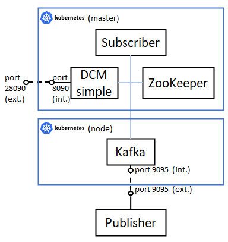

# 5. Two Kafka brokers with subscriber and publisher (Kubernetes version)

This README file contains all the steps to be followed to deploy this scenario, in which the same multi-broker architecture than described for scenario 3 is presented, but using Kubernetes in this case, deploying four pods: one Kafka broker related to one specific site, another Kafka broker related to the Interworking Layer, a ZooKeeper instance and a Kafka subscriber. A Kafka publisher completes the scenario, but this is placed in another different machine in this case, just to represent that an external entity is able to interact with a Kubernetes pod (i.e. the Kafka broker representing a site facility).



Note that the subscriber needs to be connected logically to all the brokers of the cluster in order to make the solution work, but as all pods can reach the other pods, it is allowed by default.

## Docker images involved

The following Docker images have been used for this deployment. Please verify that these images have been built beforehand.

* **DCM simple:** available in this repository: [dcm_simple](../../docker_images/separated_components/dcm_simple/v2).
* **Kafka:** available in this repository: [kafka](../../docker_images/separated_components/kafka/v2).
* **ZooKeeper:** available in this repository: [zookeeper](../../docker_images/separated_components/zookeeper).
* **NodeJS subscriber:** available in this repository: [nodejs_subscriber](../../docker_images/separated_components/nodejs_subscriber).

And also, for publisher's code, use directly the publisher.py file provided [here](../../docker_images/separated_components/complex_publisher/files/publisher.py).

## Steps to be followed

### 1. Run all pods

Before running the pods, check the following:

* All Kubernetes nodes use Docker as container daemon.
* You have built all the Docker images referenced in pods' specification.
* The nodeSelector attribute is correctly configured for each pod, according for your scenario.

Then, execute the following:

```sh
$ kubectl apply -f ./pods/zookeeper_pod.yml
$ kubectl apply -f ./pods/dcm_simple_pod.yml
$ kubectl apply -f ./pods/kafka_pod.yml
$ kubectl apply -f ./pods/subscriber_pod.yml
```

After this, take note of pods' IP addresses by running this:

```sh
$ kubectl get pods -o wide
```

You should obtain something like this:

```
NAME         READY   STATUS    RESTARTS   AGE   IP           NODE                     NOMINATED NODE   READINESS GATES
zookeeper    1/1     Running   0          56s   10.42.0.21   5geve-k3s-master-monit   <none>           <none>
dcm          1/1     Running   0          55s   10.42.0.22   5geve-k3s-master-monit   <none>           <none>
kafka        1/1     Running   0          55s   10.42.1.9    5geve-k3s-node1-monit    <none>           <none>
subscriber   1/1     Running   0          54s   10.42.0.23   5geve-k3s-master-monit   <none>           <none>
```

### 2. Configure DCM simple

Run the following scripts to configure the DCM simple container (change <xxx_pod_ip> tags for the corresponding pods' IPs):

```sh
$ kubectl exec dcm -- /bin/bash update_hosts.sh <dcm_pod_ip> dcm
$ kubectl exec dcm -- /bin/bash update_hosts.sh <kafka_pod_ip> france
$ kubectl exec dcm -- /bin/bash entrypoint.sh PLAINTEXT://0.0.0.0:9092 PLAINTEXT://dcm:9092 1 <zookeeper_pod_ip> dcm <dcm_pod_ip> 9092 > /dev/null &
```

Remember to wait until obtaining a correct response from the DCM handler (use the IP address of the node that contains the DCM pod) before continuing with the test.

```sh
$ curl --location --request GET 'http://<node_containing_dcm_pod_ip_address>:28090'
```

And also, you chan check in ZooKeeper pod that the DCM has correctly joined to ZooKeeper:

```sh
$ kubectl exec -it zookeeper -- /opt/kafka/bin/zookeeper-shell.sh <zookeeper_pod_ip>:2181 ls /brokers/ids
```

### 3. Configure the other Kafka broker

Run the following scripts to configure the DCM simple container (change <xxx_pod_ip> tags for the corresponding pods' IPs):

```sh
$ kubectl exec kafka -- /bin/bash update_hosts.sh <dcm_pod_ip> dcm
$ kubectl exec kafka -- /bin/bash update_hosts.sh <kafka_pod_ip> france
$ kubectl exec kafka -- /bin/bash entrypoint.sh PLAINTEXT://0.0.0.0:9095 PLAINTEXT://france:9095 4 <zookeeper_pod_ip> france > /dev/null &
```

And also, you chan check in ZooKeeper pod that the DCM has correctly joined to ZooKeeper:

```sh
$ kubectl exec -it zookeeper -- /opt/kafka/bin/zookeeper-shell.sh <zookeeper_pod_ip>:2181 ls /brokers/ids
```

### 4. Create a new topic with the DCM handler

First of all, create a signalling topic (e.g. signalling.kpi) by sending the following request to the DCM handler (use the IP address of the node that contains the DCM pod):

```sh
$ curl --location --request POST 'http://<node_containing_dcm_pod_ip_address>:28090/dcm/subscribe' \
--header 'Content-Type: application/json' \
--data-raw '{
	"expId": "internal", 
	"topic": "signalling.kpi"
}'
```

Then, send a new KPI topic to be created in the platform by the DCM.

```sh
$ curl --location --request POST 'http://<node_containing_dcm_pod_ip_address>:28090/dcm/publish/signalling.kpi' \
--header 'Content-Type: application/json' \
--data-raw '{
	"records": [
		{
			"value": {
				"topic": "uc.4.france_nice.kpi.service_delay",
				"expId": "4",
				"action": "subscribe",
				"context": {
					"kpiId": "service_delay",
					"graph": "LINE",
					"name": "kpi_name",
					"unit": "kpi_unit",
					"interval": "5s"
				}
			}
		}
	]
}'
```

If you list the topics currently created, you will see that signalling.kpi and uc.4.france_nice.kpi.service_delay have been created.

```sh
$ kubectl exec dcm -- /bin/bash /opt/kafka/bin/kafka-topics.sh --list --zookeeper <zookeeper_pod_ip>:2181
```

You can also check the Kafka logs present in each Kafka broker, checking that the DCM has logs for both topics and that the Kafka broker related to the site only has a log for uc.4.france_nice.kpi.service_delay

```sh
$ kubectl exec dcm -- ls /tmp/kafka-logs	# output: signalling.kpi and uc.4.france_nice.kpi.service_delay logs folders present
$ kubectl exec kafka -- ls /tmp/kafka-logs		# output: uc.4.france_nice.kpi.service_delay logs folder present
```

### 5. Configure the subscriber and run it with the new topic created by the DCM handler

Execute the following commands to configure the pod and start consuming from the topic already created. Make sure to run the command in a separate terminal because the NodeJS script will block it (close it with Ctrl+C when finishing). Moreover, make sure that you are selecting the correct combination of <broker_ip_and_port> and <rackId> arguments (you can read from both brokers, but you just need to include the correct values there).

```sh
$ kubectl exec subscriber -- /bin/sh -c "echo '<kafka_pod_ip> france' | tee -a /etc/hosts > /dev/null"
$ kubectl exec subscriber -- /bin/sh -c "echo '<dcm_pod_ip> dcm' | tee -a /etc/hosts > /dev/null"
$ kubectl exec -it subscriber -- node /usr/src/app/subscriber.js <broker_ip_and_port> <rackId> uc.4.france_nice.kpi.service_delay
```

If you want to create a Kafka native subscriber too, you can execute the following command:

```sh
$ kubectl exec dcm -- /opt/kafka/bin/kafka-console-consumer.sh --bootstrap-server <dcm_pod_ip>:9092 --topic uc.4.france_nice.kpi.service_delay --consumer-property client.rack=dcm --from-beginning
```

### 6. Run the publisher with the new topic created by the DCM handler

First of all, make sure that the server that holds the publisher code is able to reach the Kubernetes node in which the Kafka container is deployed. Then, install the requirements needed to run the script:

```sh
$ apt-get update
$ apt-get install python3 python3-pip
$ apt-get install locales
$ sudo dpkg-reconfigure locales # set "en_US.UTF-8"
$ export LC_ALL="en_US.UTF-8"
$ export LC_CTYPE="en_US.UTF-8"
$ pip3 install kafka-python
```

Finally, execute the publisher. The publisher will publish 10 metrics in the uc.4.france_nice.kpi.service_delay topic, and then it will finish its execution.

```sh
$ echo '<node_containing_dcm_pod_ip_address> france' | sudo tee -a /etc/hosts > /dev/null
$ python3 publisher.py <node_containing_dcm_pod_ip_address>:9095 uc.4.france_nice.kpi.service_delay 10
```

In the meanwhile, check that the subscriber receives the messages sent by the publisher.

If you change the broker from which the subscriber is reading the data, you will also see a difference on the publication latency, as there is a replication operation running between both brokers.

### 7. Delete the topic created by the DCM handler and check the messages in the signalling topic

Remove the topic created previously by the DCM handler by sending this request:

```sh
$ curl --location --request POST 'http://<node_containing_dcm_pod_ip_address>:28090/dcm/publish/signalling.kpi' \
--header 'Content-Type: application/json' \
--data-raw '{
	"records": [
		{
			"value": {
				"topic": "uc.4.france_nice.kpi.service_delay",
				"expId": "4",
				"action": "unsubscribe",
				"context": {
					"kpiId": "service_delay",
					"graph": "LINE",
					"name": "kpi_name",
					"unit": "kpi_unit",
					"interval": "5s"
				}
			}
		}
	]
}'
```

If you list the topics currently created, you will see that signalling.kpi is the unique topic present in the broker, and that uc.4.france_nice.kpi.service_delay has been deleted.

```sh
$ kubectl exec dcm -- /bin/bash /opt/kafka/bin/kafka-topics.sh --list --zookeeper <zookeeper_pod_ip>:2181
```

If you create a subscriber listening to the messages sent to the signalling.kpi topic, you will be able to see the two messages sent in the previous requests generated with curl: one for the subscribe operation and other for the unsubscribe operation:

```sh
$ kubectl exec dcm -- /bin/bash /opt/kafka/bin/kafka-console-consumer.sh --bootstrap-server <dcm_pod_ip>:9092 --topic signalling.kpi --from-beginning
```

Finally, delete the signalling topic and check that is has been deleted correctly.

```sh
$ curl --location --request DELETE 'http://<node_containing_dcm_pod_ip_address>:28090/dcm/unsubscribe' \
--header 'Content-Type: application/json' \
--data-raw '{
	"expId": "internal", 
	"topic": "signalling.kpi"
}'
$ kubectl exec dcm -- /bin/bash /opt/kafka/bin/kafka-topics.sh --list --zookeeper <zookeeper_pod_ip>:2181
```

### 8. Cleaning the scenario

To clean the scenario, you can execute the following commands:

```sh
$ kubectl delete -f ./pods/subscriber_pod.yml
$ kubectl delete -f ./pods/kafka_pod.yml
$ kubectl delete -f ./pods/dcm_simple_pod.yml
$ kubectl delete -f ./pods/zookeeper_pod.yml
```
