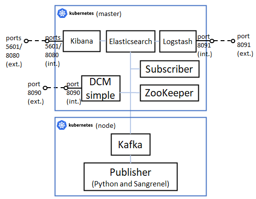

# 6. Two Kafka brokers with uncoupled DCS-DV and publisher (Kubernetes version)

This README file contains all the steps to be followed to deploy this scenario, in which the same multi-broker architecture than described for scenario 5 is presented, using Kubernetes, and deploying different pods: one Kafka broker related to one specific site, another Kafka broker related to the Interworking Layer, a ZooKeeper instance, two publishers (one based on Python and another based on Sangrenel), a NodeJS subscriber and Elasticsearch-Logstash-Kibana.



Note that the subscriber (Logstash) needs to be connected logically to all the brokers of the cluster in order to make the solution work, but as all pods can reach the other pods, it is allowed by default.

## Docker images involved

The following Docker images have been used for this deployment. Please verify that these images have been built beforehand.

* **DCM simple:** available in this repository: [dcm_simple](../../docker_images/separated_components/dcm_simple/v2).
* **Kafka:** available in this repository: [kafka](../../docker_images/separated_components/kafka/v2).
* **ZooKeeper:** available in this repository: [zookeeper](../../docker_images/separated_components/zookeeper).
* **NodeJS subscriber:** available in this repository: [nodejs_subscriber](../../docker_images/separated_components/nodejs_subscriber).
* **Complex Python publisher:** available in this repository: [complex_publisher](../../docker_images/separated_components/complex_publisher).
* **Sangrenel publisher:** available in this repository: [sangrenel_publisher](../../docker_images/separated_components/sangrenel_publisher).
* **Elasticsearch:** available in this repository: [elasticsearch](../../docker_images/separated_components/elasticsearch).
* **Logstash:** available in this repository: [logstash](../../docker_images/separated_components/logstash).
* **Kibana:** available in this repository: [kibana](../../docker_images/separated_components/kibana).

## Steps to be followed

### 1. Run all pods

Before running the pods, check the following:

* All Kubernetes nodes use Docker as container daemon.
* You have built all the Docker images referenced in pods' specification.
* The nodeSelector attribute is correctly configured for each pod, according for your scenario.

Then, execute the following:

```sh
$ kubectl apply -f ./pods/zookeeper_pod.yml
$ kubectl apply -f ./pods/dcm_simple_pod.yml
$ kubectl apply -f ./pods/kafka_pod.yml
$ kubectl apply -f ./pods/subscriber_pod.yml
$ kubectl apply -f ./pods/publisher_pod.yml
$ kubectl apply -f ./pods/sangrenel_pod.yml
$ kubectl apply -f ./pods/elasticsearch_pod.yml
$ kubectl apply -f ./pods/logstash_pod.yml
$ kubectl apply -f ./pods/kibana_pod.yml
```

After this, take note of pods' IP addresses by running this:

```sh
$ kubectl get pods -o wide
```

You should obtain something like this:

```
NAME            READY   STATUS    RESTARTS   AGE     IP           NODE                     NOMINATED NODE   READINESS GATES
dcm             1/1     Running   0          4m28s   10.42.0.55   5geve-k3s-master-monit   <none>           <none>
zookeeper       1/1     Running   0          4m28s   10.42.0.54   5geve-k3s-master-monit   <none>           <none>
kafka           1/1     Running   0          4m27s   10.42.1.35   5geve-k3s-node1-monit    <none>           <none>
subscriber      1/1     Running   0          4m27s   10.42.0.56   5geve-k3s-master-monit   <none>           <none>
publisher       1/1     Running   0          4m26s   10.42.1.36   5geve-k3s-node1-monit    <none>           <none>
sangrenel       1/1     Running   0          4m26s   10.42.1.37   5geve-k3s-node1-monit    <none>           <none>
elasticsearch   1/1     Running   0          4m25s   10.42.0.57   5geve-k3s-master-monit   <none>           <none>
logstash        1/1     Running   0          4m25s   10.42.0.58   5geve-k3s-master-monit   <none>           <none>
kibana          1/1     Running   0          4m24s   10.42.0.59   5geve-k3s-master-monit   <none>           <none>
```

### 2. Configure DCM simple

Run the following scripts to configure the DCM simple container (change <xxx_pod_ip> tags for the corresponding pods' IPs):

```sh
$ kubectl exec dcm -- /bin/bash update_hosts.sh <dcm_pod_ip> dcm
$ kubectl exec dcm -- /bin/bash update_hosts.sh <kafka_pod_ip> france
$ kubectl exec dcm -- /bin/bash entrypoint.sh PLAINTEXT://0.0.0.0:9092 PLAINTEXT://dcm:9092 1 <zookeeper_pod_ip> dcm <dcm_pod_ip> 9092 > /dev/null &
```

Remember to wait until obtaining a correct response from the DCM handler (use the IP address of the node that contains the DCM pod) before continuing with the test.

```sh
$ curl --location --request GET 'http://<node_containing_dcm_pod_ip_address>:8090'
```

And also, you chan check in ZooKeeper pod that the DCM has correctly joined to ZooKeeper:

```sh
$ kubectl exec -it zookeeper -- /opt/kafka/bin/zookeeper-shell.sh <zookeeper_pod_ip>:2181 ls /brokers/ids
```

### 3. Configure the other Kafka broker

Run the following scripts to configure the DCM simple container (change <xxx_pod_ip> tags for the corresponding pods' IPs):

```sh
$ kubectl exec kafka -- /bin/bash update_hosts.sh <dcm_pod_ip> dcm
$ kubectl exec kafka -- /bin/bash update_hosts.sh <kafka_pod_ip> france
$ kubectl exec kafka -- /bin/bash entrypoint.sh PLAINTEXT://0.0.0.0:9095 PLAINTEXT://france:9095 4 <zookeeper_pod_ip> france > /dev/null &
```

And also, you chan check in ZooKeeper pod that the DCM has correctly joined to ZooKeeper:

```sh
$ kubectl exec -it zookeeper -- /opt/kafka/bin/zookeeper-shell.sh <zookeeper_pod_ip>:2181 ls /brokers/ids
```

### 4. Configure the ELK Stack

First of all, start by running Elasticsearch:

```sh
$ kubectl exec elasticsearch -- /bin/bash entrypoint.sh &
```

Then, run Kibana:

```sh
$ kubectl exec kibana -- /bin/bash entrypoint.sh <kibana_pod_ip> \"http://<elasticsearch_pod_ip>:9200\" &
```

And finally, run Logstash:

```sh
$ kubectl exec logstash -- /bin/bash update_hosts.sh <dcm_pod_ip> dcm
$ kubectl exec logstash -- /bin/bash update_hosts.sh <kafka_pod_ip> france
$ kubectl exec logstash -- /bin/bash entrypoint.sh <elasticsearch_pod_ip> <dcm_pod_ip> \"http://<elasticsearch_pod_ip>:9200\" <kibana_pod_ip> &
```

Remember to wait until obtaining a correct response from the DCS-DV handler (use the IP address of the node that contains the Logstash pod) before continuing with the test.

```sh
$ curl --location --request GET 'http://<node_containing_logstash_pod_ip_address>:8091'
```

### 5. Create a new topic with the DCM handler

First of all, create the signalling topics by sending the following request to the Logstash container, which contains the Python logic that handles the signalling topics (use the IP address of the node that contains the Logstash pod):

```sh
$ curl --location --request POST 'http://<node_containing_logstash_pod_ip_address>:8091/portal/dcs/start_signalling' \
--header 'Content-Type: application/json' \
--data-raw ''
```

Then, send a new application metric topic to be created in the platform by the DCM. Use the IP address of the node that contains the DCM pod.

```sh
$ curl --location --request POST 'http://<node_containing_dcm_pod_ip_address>:8090/dcm/publish/signalling.metric.application' \
--header 'Content-Type: application/json' \
--data-raw '{
    "records": [
        {
            "value": {
                "topic": "uc.4.france_nice.application_metric.service_delay",
                "expId": "4",
                "action": "subscribe",
                "context": {
                    "metricId": "service_delay",
                    "metricCollectionType": "CUMULATIVE",
                    "graph": "LINE",
                    "name": "metric_name",
                    "unit": "metric_unit",
                    "interval": "5s"
                }
            }
        }
    ]
}'
```

If you list the topics currently created, you will see that signalling.kpi, signalling.metric.application, signalling.metric.infrastructure and uc.4.france_nice.application_metric.service_delay have been created.

```sh
$ kubectl exec dcm -- /bin/bash /opt/kafka/bin/kafka-topics.sh --list --zookeeper <zookeeper_pod_ip>:2181
```

You can also check the Kafka logs present in each Kafka broker, checking that the DCM has logs for all topics and that the Kafka broker related to the site only has a log for uc.4.france_nice.application_metric.service_delay

```sh
$ kubectl exec dcm -- ls /tmp/kafka-logs        # output: all signalling topics and uc.4.france_nice.application_metric.service_delay logs folders present
$ kubectl exec kafka -- ls /tmp/kafka-logs      # output: uc.4.france_nice.application_metric.service_delay logs folder present
```

Finally, open a terminal in Logstash pod in order to run it, so that it subscribes to the topic created. Wait until the logs are stopped.

```sh
$ kubectl exec -it logstash -- /bin/bash 
# Within the server:
$ source /etc/default/logstash
$ /usr/share/logstash/bin/logstash "--path.settings" "/etc/logstash" # terminal will be blocked then
```

### 6. Configure the subscriber and run it with the new topic created by the DCM handler

Execute the following commands to configure the pod and start consuming from the topic already created. Make sure to run the command in a separate terminal because the NodeJS script will block it (close it with Ctrl+C when finishing). Moreover, make sure that you are selecting the correct combination of <broker_ip_and_port> and <rackId> arguments (you can read from both brokers, but you just need to include the correct values there).

```sh
$ kubectl exec subscriber -- /bin/sh -c "echo '<kafka_pod_ip> france' | tee -a /etc/hosts > /dev/null"
$ kubectl exec subscriber -- /bin/sh -c "echo '<dcm_pod_ip> dcm' | tee -a /etc/hosts > /dev/null"
$ kubectl exec -it subscriber -- node /usr/src/app/subscriber.js <broker_ip_and_port> <rackId> uc.4.france_nice.application_metric.service_delay # Terminal will be blocked then.
```

If you want to create a Kafka native subscriber too, you can execute the following command:

```sh
$ kubectl exec dcm -- /opt/kafka/bin/kafka-console-consumer.sh --bootstrap-server <dcm_pod_ip>:9092 --topic uc.4.france_nice.application_metric.service_delay --consumer-property client.rack=dcm --from-beginning
```

### 7. Run the publisher with the new topic created by the DCM handler

The publisher will publish 10 metrics in the uc.4.france_nice.application_metric.service_delay topic, and then it will finish its execution.

```sh
$ kubectl exec publisher -- /bin/sh -c "echo '<kafka_pod_ip> france' | tee -a /etc/hosts > /dev/null"
$ kubectl exec publisher -- /bin/sh -c "echo '<dcm_pod_ip> dcm' | tee -a /etc/hosts > /dev/null"
$ kubectl exec publisher -- python3 publisher.py <kafka_pod_ip>:9095 uc.4.france_nice.application_metric.service_delay 10
```


In the meanwhile, check that the DCS-DV receives the messages sent by the publisher (you can go to the Kibana GUI with http://<node_containing_kibana_pod_ip_address>:5601 and take a look to the Kibana index receiving the data, the Kibana dashboard generated, the Elasticsearch index increasing the counter of messages received, etc.).

You can also check that the subscriber receives the messages sent by the publisher, calculating the latency that is saved in /var/log/uc.4.france_nice.application_metric.service_delay.csv file.

If you change the broker from which the subscriber is reading the data, you will also see a difference on the publication latency, as there is a replication operation running between both brokers.

### 8. Run Sangrenel with the new topic created by the DCM handler

Finally, you can also use Sangrenel to perform laod tests to the Kafka broker. Remember to finish the execution of Sangrenel with Ctrl+C.

```sh
$ kubectl exec sangrenel -- /bin/sh -c "echo '<kafka_pod_ip> france' | tee -a /etc/hosts > /dev/null"
$ kubectl exec sangrenel -- /bin/sh -c "echo '<dcm_pod_ip> dcm' | tee -a /etc/hosts > /dev/null"
$ kubectl exec sangrenel -- /go/bin/sangrenel -brokers <kafka_pod_ip>:9095 -interval 1 -message-batch-size 1 -message-size 100 -produce-rate 1000 -topic uc.4.france_nice.application_metric.service_delay -writers-per-worker 1 # Stop with Ctrl+C.
```

### 9. Delete the topic created by the DCM handler and check the messages in the signalling topic

Remove the topic created previously by the DCM handler by sending this request:

```sh
$ curl --location --request POST 'http://<node_containing_dcm_pod_ip_address>:8090/dcm/publish/signalling.metric.application' \
--header 'Content-Type: application/json' \
--data-raw '{
    "records": [
        {
            "value": {
                "topic": "uc.4.france_nice.application_metric.service_delay",
                "expId": "4",
                "action": "unsubscribe",
                "context": {
                    "metricId": "service_delay",
                    "metricCollectionType": "CUMULATIVE",
                    "graph": "LINE",
                    "name": "metric_name",
                    "unit": "metric_unit",
                    "interval": "5s"
                }
            }
        }
    ]
}'
```

After this, you can close Logstash in the terminal opened for that purpose, and also the NodeJS subscriber.

If you list the topics currently created, you will see that signalling topics are the unique topics present in the broker, and that uc.4.france_nice.application_metric.service_delay has been deleted.

```sh
$ kubectl exec dcm -- /bin/bash /opt/kafka/bin/kafka-topics.sh --list --zookeeper <zookeeper_pod_ip>:2181
```

If you create a subscriber listening to the messages sent to the signalling.metric.application topic, you will be able to see the two messages sent in the previous requests generated with curl: one for the subscribe operation and other for the unsubscribe operation:

```sh
$ kubectl exec dcm -- /bin/bash /opt/kafka/bin/kafka-console-consumer.sh --bootstrap-server <dcm_pod_ip>:9092 --topic signalling.metric.application --from-beginning
```

Finally, delete the signalling topics and check that they have been deleted correctly.

```sh
$ curl --location --request DELETE 'http://<node_containing_zookeeper_pod_ip_address>::8091/portal/dcs/stop_signalling' \
--header 'Content-Type: application/json' \
--data-raw ''
$ kubectl exec dcm -- /bin/bash /opt/kafka/bin/kafka-topics.sh --list --zookeeper <zookeeper_pod_ip>:2181
```

### 10. Cleaning the scenario

To clean the scenario, you can execute the following commands:

```sh
$ kubectl delete -f ./pods/kibana_pod.yml
$ kubectl delete -f ./pods/logstash_pod.yml
$ kubectl delete -f ./pods/elasticsearch_pod.yml
$ kubectl delete -f ./pods/sangrenel_pod.yml
$ kubectl delete -f ./pods/publisher_pod.yml
$ kubectl delete -f ./pods/subscriber_pod.yml
$ kubectl delete -f ./pods/kafka_pod.yml
$ kubectl delete -f ./pods/dcm_simple_pod.yml
$ kubectl delete -f ./pods/zookeeper_pod.yml
```
