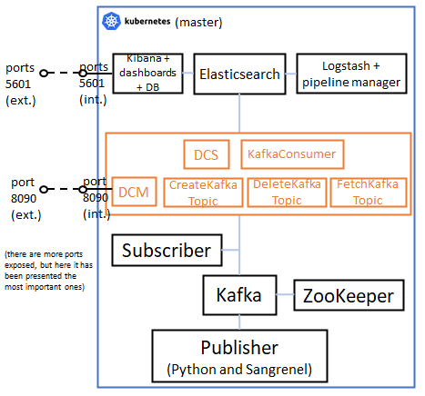

# 7. Microservices deployment (Kubernetes version)

This README file contains all the steps to be followed to deploy this scenario, based on Kubernetes, in which it is presented the Monitoring platform based on microservices, which is the previous step before achieving the integration of serverless functions.



## Docker images involved

The following Docker images have been used for this deployment. Please verify that these images have been built beforehand.

* **Complex Python publisher:** available in this repository: [complex_publisher](../../docker_images/microservices_scenario/complex_publisher).
* **Complex Python subscriber:** available in this repository: [complex_subscriber](../../docker_images/microservices_scenario/complex_subscriber).
* **Create Kafka Topic:** available in this repository: [create_kafka_topic](../../docker_images/microservices_scenario/create_kafka_topic).
* **DCM:** available in this repository: [dcm](../../docker_images/microservices_scenario/dcm).
* **DCS:** available in this repository: [dcs](../../docker_images/microservices_scenario/dcs).
* **Delete Kafka Topic:** available in this repository: [delete_kafka_topic](../../docker_images/microservices_scenario/delete_kafka_topic).
* **Elasticsearch:** available in this repository: [elasticsearch](../../docker_images/microservices_scenario/elasticsearch/v1).
* **Fetch Kafka Topic:** available in this repository: [fetch_kafka_topic](../../docker_images/microservices_scenario/fetch_kafka_topic).
* **Kafka:** available in this repository: [kafka](../../docker_images/microservices_scenario/kafka/v1).
* **Kafka Consumer:** available in this repository: [kafka_consumer](../../docker_images/microservices_scenario/kafka_consumer).
* **Kibana:** available in this repository: [kibana](../../docker_images/microservices_scenario/kibana).
* **Logstash Pipeline Manager:** available in this repository: [logstash_pipeline_manager](../../docker_images/microservices_scenario/logstash_pipeline_manager/v1).
* **Sangrenel publisher:** available in this repository: [sangrenel_publisher](../../docker_images/microservices_scenario/sangrenel_publisher).
* **ZooKeeper:** available in this repository: [zookeeper](../../docker_images/microservices_scenario/zookeeper).

## Steps to be followed

### 1. Run all pods

Before running the pods, check the following:

* The Kubernetes node uses Docker as container daemon.
* You have built all the Docker images referenced in pods' specification.

Then, execute the following:

```sh
$ kubectl apply -f ./pods/create_kafka_topic_pod.yml
$ kubectl apply -f ./pods/dcm_pod.yml
$ kubectl apply -f ./pods/dcs_pod.yml
$ kubectl apply -f ./pods/delete_kafka_topic_pod.yml
$ kubectl apply -f ./pods/elasticsearch_pod.yml
$ kubectl apply -f ./pods/fetch_kafka_topic_pod.yml
$ kubectl apply -f ./pods/kafka_consumer_pod.yml
$ kubectl apply -f ./pods/kafka_pod.yml
$ kubectl apply -f ./pods/kibana_pod.yml
$ kubectl apply -f ./pods/logstash_pipeline_manager_pod.yml
$ kubectl apply -f ./pods/publisher_pod.yml
$ kubectl apply -f ./pods/sangrenel_pod.yml
$ kubectl apply -f ./pods/subscriber_pod.yml
$ kubectl apply -f ./pods/zookeeper_pod.yml
```

After this, take note of pods' IP addresses by running this:

```sh
$ kubectl get pods -o wide
```

You should obtain something like this:

```
NAME                        READY   STATUS    RESTARTS   AGE     IP           NODE                     NOMINATED NODE   READINESS GATES
elasticsearch               1/1     Running   0          8s      10.42.0.73   5geve-k3s-master-monit   <none>           <none>
kibana                      1/1     Running   0          8s      10.42.0.75   5geve-k3s-master-monit   <none>           <none>
kafka                       1/1     Running   0          8s      10.42.0.74   5geve-k3s-master-monit   <none>           <none>
publisher                   1/1     Running   0          8s      10.42.0.76   5geve-k3s-master-monit   <none>           <none>
sangrenel                   1/1     Running   0          8s      10.42.0.77   5geve-k3s-master-monit   <none>           <none>
subscriber                  1/1     Running   0          8s      10.42.0.78   5geve-k3s-master-monit   <none>           <none>
zookeeper                   1/1     Running   0          8s      10.42.0.79   5geve-k3s-master-monit   <none>           <none>
logstash-pipeline-manager   1/1     Running   0          8s      10.42.0.85   5geve-k3s-master-monit   <none>           <none>
create-kafka-topic          1/1     Running   0          8s      10.42.0.86   5geve-k3s-master-monit   <none>           <none>
delete-kafka-topic          1/1     Running   0          7s      10.42.0.87   5geve-k3s-master-monit   <none>           <none>
fetch-kafka-topic           1/1     Running   0          7s      10.42.0.88   5geve-k3s-master-monit   <none>           <none>
kafka-consumer              1/1     Running   0          6s      10.42.0.89   5geve-k3s-master-monit   <none>           <none>
dcs                         1/1     Running   0          5s      10.42.0.91   5geve-k3s-master-monit   <none>           <none>
dcm                         1/1     Running   0          6s      10.42.0.93   5geve-k3s-master-monit   <none>           <none>
```

### 2. Configure Kafka

Run the following scripts to configure the Kafka container (change <xxx_pod_ip> tags for the corresponding pods' IPs):

```sh
$ kubectl exec kafka -- /bin/bash update_hosts.sh <kafka_pod_ip> dcm
$ kubectl exec kafka -- /bin/bash entrypoint.sh PLAINTEXT://0.0.0.0:9092 PLAINTEXT://dcm:9092 1 <zookeeper_pod_ip> dcm > /dev/null &
```

And also, you chan check in ZooKeeper pod that Kafka has correctly joined to ZooKeeper:

```sh
$ kubectl exec -it zookeeper -- /opt/kafka/bin/zookeeper-shell.sh <zookeeper_pod_ip>:2181 ls /brokers/ids
```

### 3. Configure the ELK Stack

First of all, start by running Elasticsearch:

```sh
$ kubectl exec elasticsearch -- /bin/bash entrypoint.sh &
```

Then, run Kibana:

```sh
$ kubectl exec kibana -- /bin/bash entrypoint.sh <kibana_pod_ip> \"http://<elasticsearch_pod_ip>:9200\" &
```

And finally, run Logstash:

```sh
$ kubectl exec logstash_pipeline_manager -- /bin/bash update_hosts.sh <kafka_pod_ip> dcm
$ kubectl exec logstash_pipeline_manager -- /bin/bash entrypoint.sh \"http://<elasticsearch_pod_ip>:9200\" <kafka_pod_ip>:9092 <elasticsearch_pod_ip>:9200 &
```

### 4. Deploy microservices

Then, it is time to create the microservices related to the serverless functions.

First of all, start by running the DCM:

```sh
$ kubectl exec dcm -- /bin/bash entrypoint.sh <dcs_pod_ip>:8091 <create_kafka_topic_pod_ip>:8190 <delete_kafka_topic_pod_ip>:8290 <fetch_kafka_topic_pod_ip>:8390 &
```

Continue with the DCS:

```sh
$ kubectl exec dcs -- /bin/bash entrypoint.sh <kibana_pod_ip>:8080 <logstash_pipeline_manager_pod_ip>:8191 <kafka_consumer_pod_ip>:8291 <elasticsearch_pod_ip>:9200 &
```

Then, the Create Kafka Topic service:

```sh
$ kubectl exec create_kafka_topic -- /bin/bash update_hosts.sh <kafka_pod_ip> dcm
$ kubectl exec create_kafka_topic -- /bin/bash entrypoint.sh <kafka_pod_ip>:9092 &
```

Next, the Delete Kafka Topic service:

```sh
$ kubectl exec delete_kafka_topic -- /bin/bash update_hosts.sh <kafka_pod_ip> dcm
$ kubectl exec delete_kafka_topic -- /bin/bash entrypoint.sh <kafka_pod_ip>:9092 &
```

Continue with the Fetch Kafka Topic service:

```sh
$ kubectl exec fetch_kafka_topic -- /bin/bash update_hosts.sh <kafka_pod_ip> dcm
$ kubectl exec fetch_kafka_topic -- /bin/bash entrypoint.sh <kafka_pod_ip>:9092 &
```

And finally, deploy the Kafka Consumer service:

```sh
$ kubectl exec kafka_consumer -- /bin/bash update_hosts.sh <kafka_pod_ip> dcm
$ kubectl exec kafka_consumer -- /bin/bash entrypoint.sh <kibana_pod_ip>:8080 <kafka_pod_ip>:9092 &
```

### 5. Create a new topic with the DCM handler

Send a new application metric topic to be created in the platform. Use the IP address of the node that contains the DCM pod.

```sh
$ curl --location --request POST 'http://<node_containing_dcm_pod_ip_address>:8090/dcm/subscribe' \
--header 'Content-Type: application/json' \
--data-raw '{
    "records": [
        {
            "value": {
                "topic": "uc.4.france_nice.application_metric.service_delay",
                "expId": "4",
                "action": "subscribe",
                "context": {
                    "metricId": "service_delay",
                    "metricCollectionType": "CUMULATIVE",
                    "graph": "LINE",
                    "name": "metric_name",
                    "unit": "metric_unit",
                    "interval": "5s"
                }
            }
        }
    ]
}'
```

If you list the topics currently created, you will see that uc.4.france_nice.application_metric.service_delay has been created.

```sh
$ kubectl exec kafka -- /bin/bash /opt/kafka/bin/kafka-topics.sh --list --zookeeper <zookeeper_pod_ip>:2181
```

Finally, open a terminal in Logstash Pipeline Manager pod in order to run it, so that it subscribes to the topic created. Wait until the logs are stopped.

```sh
$ kubectl exec -it logstash_pipeline_manager -- /bin/bash 
# Within the server:
$ source /etc/default/logstash
$ /usr/share/logstash/bin/logstash "--path.settings" "/etc/logstash" # terminal will be blocked then
```

### 6. Run the publisher with the new topic created by the DCM handler

The publisher will publish 10 metrics in the uc.4.france_nice.application_metric.service_delay topic, and then it will finish its execution.

```sh
$ kubectl exec publisher -- /bin/sh -c "echo '<kafka_pod_ip> dcm' | tee -a /etc/hosts > /dev/null"
$ kubectl exec publisher -- python3 publisher.py <kafka_pod_ip>:9092 uc.4.france_nice.application_metric.service_delay 10
```

In the meanwhile, check that the DCS-DV receives the messages sent by the publisher (you can go to the Kibana GUI with http://<node_containing_kibana_pod_ip_address>:5601 and take a look to the Kibana index receiving the data, the Kibana dashboard generated, the Elasticsearch index increasing the counter of messages received, etc.).

You can also run the subscriber in order to confirm that it receives the messages sent by the publisher.

### 7. Run Sangrenel with the new topic created by the DCM handler

Finally, you can also use Sangrenel to perform laod tests to the Kafka broker. Remember to finish the execution of Sangrenel with Ctrl+C.

```sh
$ kubectl exec sangrenel -- /bin/sh -c "echo '<kafka_pod_ip> dcm' | tee -a /etc/hosts > /dev/null"
$ kubectl exec sangrenel -- /go/bin/sangrenel -brokers <kafka_pod_ip>:9092 -interval 1 -message-batch-size 1 -message-size 100 -produce-rate 1000 -topic uc.4.france_nice.application_metric.service_delay -writers-per-worker 1 # Stop with Ctrl+C.
```

### 8. Delete the topic created by the DCM handler

Remove the topic created previously by the DCM handler by sending this request:

```sh
$ curl --location --request DELETE 'http://<node_containing_dcm_pod_ip_address>:8090/dcm/unsubscribe' \
--header 'Content-Type: application/json' \
--data-raw '{
    "records": [
        {
            "value": {
                "topic": "uc.4.france_nice.application_metric.service_delay",
                "expId": "4",
                "action": "unsubscribe",
                "context": {
                    "metricId": "service_delay",
                    "metricCollectionType": "CUMULATIVE",
                    "graph": "LINE",
                    "name": "metric_name",
                    "unit": "metric_unit",
                    "interval": "5s"
                }
            }
        }
    ]
}'
```

After this, you can close Logstash in the terminal opened for that purpose.

If you list the topics currently created, you will see that uc.4.france_nice.application_metric.service_delay has been deleted.

```sh
$ kubectl exec dcm -- /bin/bash /opt/kafka/bin/kafka-topics.sh --list --zookeeper <zookeeper_pod_ip>:2181
```

### 9. Cleaning the scenario

To clean the scenario, you can execute the following commands:

```sh
$ kubectl delete -f ./pods/create_kafka_topic_pod.yml
$ kubectl delete -f ./pods/dcm_pod.yml
$ kubectl delete -f ./pods/dcs_pod.yml
$ kubectl delete -f ./pods/delete_kafka_topic_pod.yml
$ kubectl delete -f ./pods/elasticsearch_pod.yml
$ kubectl delete -f ./pods/fetch_kafka_topic_pod.yml
$ kubectl delete -f ./pods/kafka_consumer_pod.yml
$ kubectl delete -f ./pods/kafka_pod.yml
$ kubectl delete -f ./pods/kibana_pod.yml
$ kubectl delete -f ./pods/logstash_pipeline_manager_pod.yml
$ kubectl delete -f ./pods/publisher_pod.yml
$ kubectl delete -f ./pods/sangrenel_pod.yml
$ kubectl delete -f ./pods/subscriber_pod.yml
$ kubectl delete -f ./pods/zookeeper_pod.yml
```
