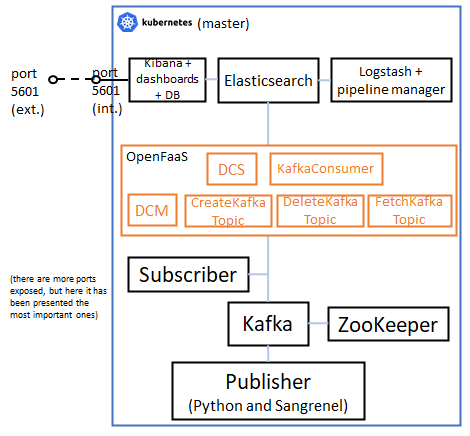

# 8. Microservices deployment (Kubernetes with DNS + OpenFaaS)

This README file contains all the steps to be followed to deploy this scenario, based on Kubernetes, in which it is presented the Monitoring platform based on microservices, using OpenFaaS for deploying the serverless functions related to Kafka.



## Docker images involved

The following Docker images have been used for this deployment. Please verify that these images have been built beforehand.

* **Complex Python publisher:** available in this repository: [complex_publisher](../../docker_images/microservices_scenario/complex_publisher).
* **Sangrenel publisher:** available in this repository: [sangrenel_publisher](../../docker_images/microservices_scenario/sangrenel_publisher).
* **Complex Python subscriber:** available in this repository: [complex_subscriber](../../docker_images/microservices_scenario/complex_subscriber).
* **ZooKeeper:** available in this repository: [zookeeper](../../docker_images/microservices_scenario/zookeeper).
* **Kafka:** available in this repository: [kafka](../../docker_images/microservices_scenario/kafka/v3).
* **Elasticsearch:** available in this repository: [elasticsearch](../../docker_images/microservices_scenario/elasticsearch/v3).
* **Kibana:** available in this repository: [kibana](../../docker_images/microservices_scenario/kibana/v3).
* **Logstash Pipeline Manager:** available in this repository: [logstash_pipeline_manager](../../docker_images/microservices_scenario/logstash_pipeline_manager/v3).

## Serverless functions involved

The following serverless functions have been used for this deployment. Please verify that these images have been built beforehand (instructions available in this [README file](../../serverless_functions/README.md)).

* **[create-kafka](../../serverless_functions/create-kafka):** implements the Create Kafka Topic function.
* **[dcm](../../serverless_functions/dcm):** implements the DCM function.
* **[dcs](../../serverless_functions/dcs):** implements the DCS function.
* **[delete-kafka](../../serverless_functions/delete-kafka):** implements the Delete Kafka Topic function.
* **[fetch-kafka](../../serverless_functions/fetch-kafka):** implements the Fetch Kafka Topic function.
* **[kafka-consumer](../../serverless_functions/kafka-consumer):** implements the Kafka Consumer function.

## Steps to be followed

### 1. Run all pods

Before running the pods, check the following:

* The Kubernetes node uses Docker as container daemon.
* You have built all the Docker images referenced in pods' specification.

> Note: better to deploy everything in a new namespace

```sh
$ kubectl create namespace deployment8
$ kubectl config set-context --current --namespace=deployment8
```

Then, execute the following:

```sh
$ kubectl apply -f ./pods/publisher_pod.yml
$ kubectl apply -f ./pods/subscriber_pod.yml
$ kubectl apply -f ./pods/sangrenel_pod.yml
$ kubectl apply -f ./pods/zookeeper_pod.yml
$ kubectl apply -f ./pods/kafka_pod.yml
$ kubectl apply -f ./pods/elasticsearch_pod.yml
$ kubectl apply -f ./pods/kibana_pod.yml
$ kubectl apply -f ./pods/logstash_pipeline_manager_pod.yml
```

After this, take note of IP addresses by running this:

```sh
$ kubectl get pods -o wide
$ kubectl get deployments
$ kubectl get services
```

You should obtain something like this for services:

```
NAME            TYPE        CLUSTER-IP       EXTERNAL-IP   PORT(S)             AGE
elasticsearch   ClusterIP   10.97.2.49       <none>        9200/TCP            29d
kafka           ClusterIP   10.103.246.244   <none>        9092/TCP            20d
kibana          ClusterIP   10.105.217.127   <none>        5601/TCP,8080/TCP   29d
logstash        ClusterIP   10.108.150.73    <none>        8191/TCP            29d
zookeeper       ClusterIP   10.107.207.146   <none>        2181/TCP            29d
```

You will need the pod's names in the following commands. You can export them to environment variables (remember to execute the commands in all terminals you are going to use):

```sh
$ publisher_pod=$(sudo kubectl get pods -o wide | grep publisher | awk '{print $1}')
$ subscriber_pod=$(sudo kubectl get pods -o wide | grep subscriber | awk '{print $1}')
$ sangrenel_pod=$(sudo kubectl get pods -o wide | grep sangrenel | awk '{print $1}')
$ zookeeper_pod=$(sudo kubectl get pods -o wide | grep zookeeper | awk '{print $1}')
$ kafka_pod=$(sudo kubectl get pods -o wide | grep kafka | awk '{print $1}')
$ elasticsearch_pod=$(sudo kubectl get pods -o wide | grep elasticsearch | awk '{print $1}')
$ kibana_pod=$(sudo kubectl get pods -o wide | grep kibana | awk '{print $1}')
$ logstash_pod=$(sudo kubectl get pods -o wide | grep logstash | awk '{print $1}')

# To check the output:
$ echo $publisher_pod
$ echo $subscriber_pod
$ echo $sangrenel_pod
$ echo $zookeeper_pod
$ echo $kafka_pod
$ echo $elasticsearch_pod
$ echo $kibana_pod
$ echo $logstash_pod
```

### 2. Run all serverless functions

Execute the following (you have to move to [serverless_functions directory](../../serverless_functions)):

```sh
$ faas-cli build -f ./stack.yml # just in case
$ faas-cli deploy -f ./stack.yml
$ kubectl get pods -o wide -n openfaas-fn # to check the pods
```

You should obtain something like this:

```
NAME                             READY   STATUS    RESTARTS   AGE   IP             NODE            NOMINATED NODE   READINESS GATES
create-kafka-cd6f6cfb5-4wpn2     1/1     Running   0          17s   10.244.0.209   tardis.tlc.pg   <none>           <none>
dcm-5b5f654857-qqj45             1/1     Running   0          17s   10.244.0.208   tardis.tlc.pg   <none>           <none>
dcs-5998f87565-dj24r             1/1     Running   0          17s   10.244.0.212   tardis.tlc.pg   <none>           <none>
delete-kafka-75d69bbfc-rvfpb     1/1     Running   0          17s   10.244.0.211   tardis.tlc.pg   <none>           <none>
fetch-kafka-7b946bd8d9-tvr4s     1/1     Running   0          17s   10.244.0.210   tardis.tlc.pg   <none>           <none>
kafka-consumer-5c957f54b-jqjqz   1/1     Running   0          17s   10.244.0.207   tardis.tlc.pg   <none>           <none>
```

### 3. Check ZooKeeper and Kafka

You can check in ZooKeeper pod that Kafka has correctly joined ZooKeeper:

```sh
$ kubectl exec -it $zookeeper_pod -- /opt/kafka/bin/zookeeper-shell.sh zookeeper:2181 ls /brokers/ids
```

Check that Kafka broker is reachable from a client:

```sh
$ kubectl run alpine --image=alpine:latest -i --tty --rm=true
$ apk update
$ apk add kafkacat
$ kafkacat -b kafka:9092 -L
```

### 4. Create a new topic with the DCM serverless function

Send a new application metric topic to be created in the platform. Use the IP address of the OpenFaas gateway that contains the DCM serverless function.

```sh
$ curl --location --request POST 'http://10.244.0.97:8080/function/dcm' \
--header 'Content-Type: application/json' \
--data-raw '{
    "records": [
        {
            "value": {
                "topic": "uc.4.france_nice.application_metric.service_delay",
                "expId": "4",
                "action": "subscribe",
                "context": {
                    "metricId": "service_delay",
                    "metricCollectionType": "CUMULATIVE",
                    "graph": "LINE",
                    "name": "metric_name",
                    "unit": "metric_unit",
                    "interval": "5s"
                }
            }
        }
    ]
}'
```

If you list the topics currently created, you will see that uc.4.france_nice.application_metric.service_delay has been created.

```sh
$ kubectl exec $kafka_pod -- /bin/bash /opt/kafka/bin/kafka-topics.sh --list --zookeeper zookeeper:2181
```

Finally, open a terminal in Logstash Pipeline Manager pod in order to run it, so that it subscribes to the topic created. Wait until the logs are stopped.

```sh
$ kubectl exec -it $logstash_pod -- /bin/bash 
# Within the server:
$ source /etc/default/logstash
$ /usr/share/logstash/bin/logstash "--path.settings" "/etc/logstash" # terminal will be blocked then
```

### 5. Run the publisher with the new topic created by the DCM serverless function

The publisher will publish 10 metrics in the uc.4.france_nice.application_metric.service_delay topic, and then it will finish its execution.

```sh
$ kubectl exec publisher -- python3 publisher.py kafka:9092 uc.4.france_nice.application_metric.service_delay 10
```

In the meanwhile, check that the DCS-DV receives the messages sent by the publisher (you can go to the Kibana GUI with http://<node_containing_kibana_pod_ip_address>:5601 and take a look to the Kibana index receiving the data, the Kibana dashboard generated, the Elasticsearch index increasing the counter of messages received, etc.).

You can also run the subscriber in order to confirm that it receives the messages sent by the publisher.

### 6. Run Sangrenel with the new topic created by the DCM serverless function (optional)

Finally, you can also use Sangrenel to perform laod tests to the Kafka broker. Remember to finish the execution of Sangrenel with Ctrl+C.

```sh
$ kubectl exec sangrenel -- /go/bin/sangrenel -brokers kafka:9092 -interval 1 -message-batch-size 1 -message-size 100 -produce-rate 1000 -topic uc.4.france_nice.application_metric.service_delay -writers-per-worker 1 # Stop with Ctrl+C.
```

### 7. Delete the topic created by the DCM serverless function

Remove the topic created previously by the DCM serverless function by sending this request:

```sh
$ curl --location --request DELETE 'http://10.244.0.97:8080/function/dcm' \
--header 'Content-Type: application/json' \
--data-raw '{
    "records": [
        {
            "value": {
                "topic": "uc.4.france_nice.application_metric.service_delay",
                "expId": "4",
                "action": "subscribe",
                "context": {
                    "metricId": "service_delay",
                    "metricCollectionType": "CUMULATIVE",
                    "graph": "LINE",
                    "name": "metric_name",
                    "unit": "metric_unit",
                    "interval": "5s"
                }
            }
        }
    ]
}'
```

After this, you can close Logstash in the terminal opened for that purpose.

If you list the topics currently created, you will see that uc.4.france_nice.application_metric.service_delay has been deleted.

```sh
$ kubectl exec $kafka_pod -- /bin/bash /opt/kafka/bin/kafka-topics.sh --list --zookeeper zookeeper:2181
```

### 8. Cleaning the scenario

To clean the scenario, you can execute the following commands to remove the pods:

```sh
$ kubectl delete -f ./pods/publisher_pod.yml
$ kubectl delete -f ./pods/subscriber_pod.yml
$ kubectl delete -f ./pods/sangrenel_pod.yml
$ kubectl delete -f ./pods/zookeeper_pod.yml
$ kubectl delete -f ./pods/kafka_pod.yml
$ kubectl delete -f ./pods/elasticsearch_pod.yml
$ kubectl delete -f ./pods/kibana_pod.yml
$ kubectl delete -f ./pods/logstash_pipeline_manager_pod.yml
```

These are the commands to remove the serverless functions (you have to move to [serverless_functions directory](../../serverless_functions)):

```sh
$ faas-cli remove -f ./stack.yml
$ kubectl get pods -o wide -n openfaas-fn # to check the pods
```

And finally, clean the namespace if required 

```sh
$ kubectl delete namespace deployment8
```
